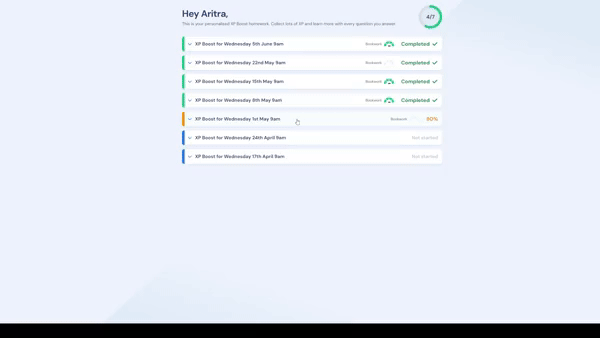

  

  # Sparx Bookwork Tracker

  

  ## Tired of bookwork checks? ✅

  `Sparx Bookwork Tracker` **automatically** tracks your answers and shows you the answer to bookwork checks. Also, includes option to **automatically** click 'next' buttons.

  **Less work, More progress! 💪**

  

---

# ⬇️ Installation
Currently only supported by browsers that allow Chrome-based extensions (e.g. Chrome, Brave, Edge, Opera).

- Click on the latest release (on the right of the page, under the 'About' section).
- Download 'Sparx Bookwork Tracker.zip'.
- Extract the file (and move the extracted folder to a location you prefer).
- Open your browser.
- Turn on 'Developer mode' (you may not need to do this, specifics differ depending on the browser)
- Click on 'Load unpacked' and select the extracted folder.
- Turn on the extension and you're ready to go!\

---

# Message for Sparx

If you have any problems with this project, please send me an email at aritra8.codes@gmail.com.