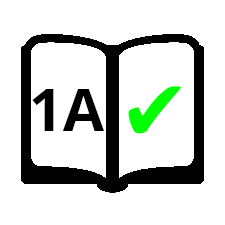

  

  # Sparx Bookwork Tracker

  
  
  

  ## Tired of bookwork checks? ✅

  `Sparx Bookwork Tracker` **automatically** tracks your answers and shows you the answer to bookwork checks. Also includes more time-saving features!

  **Less work, More progress! 💪**

  

  If this helps you, please ⭐ the repository & [follow me](https://github.com/aritra-codes) :D

---

# ✨ Features

- Automatically saves answers and shows you the **answer to bookwork checks**.
- Automatically **clicks 'next' buttons** (e.g. Continue, Next task) when Auto-next is on.
- Makes **all text selectable**.

---

# ⬇️ Installation

Currently only supported by browsers that allow Chrome-based extensions (e.g. Chrome, Brave, Edge, Opera).

- Click on the latest [release](https://github.com/aritra-codes/sparx-bookwork-tracker/releases/) (under the 'About' section).

- Download 'SparxBookworkTracker.zip'.
- Extract the file (and move the extracted folder to a location you prefer).
- Open your browser.
- Go to 'Extensions' (or 'Add-ons').
- Turn on 'Developer mode' (you may not need to do this, specifics differ depending on the browser).
- Click on 'Load unpacked' and select the extracted folder.
- Turn on the extension and you're ready to go!

**Make sure to refresh the Sparx website if you are already on it.**

---

# 🔄 Updating

**If you are in the middle of doing homework, either finish the homework or log out then log back in after updating.**

- Remove the extension from your browser in 'Extensions' (or 'Add-ons').
- Follow the installations instructions above.

---

# 😊 Reviews

*"Truly, an impressive extension; it has saved me countless hours of noting down worthless checks! A feat of engineering that surely cannot be topped- its sleek design and easy usage makes the Sparx Bookwork Tracker dominant over all."*

\- [Etaj](https://github.com/Etaj-codes)

*"I hate sparx but this extension removes some of the hassle."*

\- [Pogget](https://github.com/Pogget)

---

# ‼️ Disclaimer
This project is not associated with Sparx Maths.

If you have any problems with this project, please send me an email at aritra8.codes@gmail.com.
